# SyncoBox網頁設計規範

###### tags: `web-design`

## 目錄

- **[1. 通用基礎](#1.-通用基礎)**
  - **[1-1 色彩 Colors](#1-1-色彩)**
  - **[1-2 字體與排版 Typography](#1-2-字體與排版)**
- **[2. 元件設計](#2.-元件設計)**
  - **[2-1 按鈕 Buttons](#2-1-按鈕-buttons)**
  - **[2-2 資料表格 Data tables](#2-2-資料表格-data-tables)**
  - **[2-3 訊息視窗 Dialogs](#2-3-dialogs)**
  - **[2-4 標籤 Chips](#2-4-標籤-chips)**
  - **[2-5 載入進度條 Loader](#2-5-載入進度條-loader)**
  - **[2-6 菜單 Menus](#2-6-菜單-menus)**
- **[3. 頁面設計](#3.-頁面設計)**
  - **[3-1 App頁面設定](#3-1-app頁面設定)**
  - **[3-2 資產管理頁面](#3-2-資產管理頁面)**
---

## 1. 通用基礎

1. 為了使SyncoBox符合直覺易用、一致性與標準化等使用者體驗原則，此文件將針對SyncoBox Web的色彩、Typography及各種元件進行統一規範。
2. 請先利用npm下載SyncoBox的CSS檔案
```
npm install syncobox-style@version
```

```
//main.js

import 'syncobox-style/dist/sb-styles.css'
```

### 1-1 色彩

#### (1)命名
- 所有色彩名稱繼承Vuetify的規範，並以16進位的Hex系統作為CSS的色彩格式。
#### (2)使用
- 每一個頁面(Page)與其中的元件(Component)，將依照其顯示資訊、互動性與任務屬性，指定對應的顏色名稱。詳細規範請往下參照對各元件的設計要求。
#### (3)預設值
<span style="color:#006ad8; font-weight:900; font-family: Roboto;">primary</span>
<span style="color:#0288D1; font-weight:900; font-family: Roboto;">light-bule darken-2</span>
<span style="color:#0399c5; font-weight:900; font-family: Roboto;">primary-gf</span>
<span style="color:#424242; font-weight:900; font-family: Roboto;">secondary</span>
<span style="color:#82B1FF; font-weight:900; font-family: Roboto;">accent</span>
<span style="color:#FF5252; font-weight:900; font-family: Roboto;">error</span>
<span style="color:#2196F3; font-weight:900; font-family: Roboto;">info</span>
<span style="color:#4CAF50; font-weight:900; font-family: Roboto;">success</span>
<span style="color:#FFC107; font-weight:900; font-family: Roboto;">warning</span>

<span style="background-color:#006ad8; color:#ffffff; font-weight:900; font-family: Roboto;">primary</span>
<span style="background-color:#0288D1; color:#ffffff; font-weight:900; font-family: Roboto;">light-bule darken-2</span>
<span style="background-color:#0399c5; color:#ffffff; font-weight:900; font-family: Roboto;">primary-gf</span>
<span style="background-color:#424242; color:#ffffff; font-weight:900; font-family: Roboto;">secondary</span>
<span style="background-color:#82B1FF; color:#ffffff; font-weight:900; font-family: Roboto;">accent</span>
<span style="background-color:#FF5252; color:#ffffff; font-weight:900; font-family: Roboto;">error</span>
<span style="background-color:#2196F3; color:#ffffff; font-weight:900; font-family: Roboto;">info</span>
<span style="background-color:#4CAF50; color:#ffffff; font-weight:900; font-family: Roboto;">success</span>
<span style="background-color:#FFC107; color:#ffffff; font-weight:900; font-family: Roboto;">warning</span>

```javascript
{
    primary: "#006ad8",
    primary-gf: "#0399c5",
    light-bule darken-2: "#0288D1",
    secondary: "#424242",
    accent: "#82B1FF",
    error: "#FF5252",
    info: "#2196F3",
    success: "#4CAF50",
    warning: "#FFC107",
}
```

**[⬆ back to top](#syncobox網頁設計規範)**

---

### 1-2 字體與排版

```
html{
  font-size:16px;
  font-family:  'Microsoft Jhenghei', 'Roboto';
}
```
#### (1)尺寸資訊與字體重量
Class|Information 
---|---|
.display-4|<span style="font-weight:300; font-family: 'Microsoft Jhenghei', Roboto; font-size:6rem">Light 96sp/6rem</span>
.display-3|<span style="font-weight:300; font-family: 'Microsoft Jhenghei', Roboto; font-size:3.75rem">Light 60sp/3.75rem</span>
.display-2|<span style="font-weight:400; font-family: 'Microsoft Jhenghei', Roboto; font-size:3rem">Regular 48sp/3rem</span>
.display-1|<span style="font-weight:400; font-family: 'Microsoft Jhenghei', Roboto; font-size:2.125rem">Regular 34sp/2.125rem</span>
.headline|<span style="font-weight:400; font-family: 'Microsoft Jhenghei', Roboto; font-size:1.5rem">Regular 24sp/1.5rem</span>
.title|<span style="font-weight:500; font-family: 'Microsoft Jhenghei', Roboto; font-size:1.25rem">Medium 20sp/1.25rem</span>
.subtitle-1|<span style="font-weight:400; font-family: 'Microsoft Jhenghei', Roboto; font-size:1rem">Regular 16sp/1rem</span>
.subtitle-2|<span style="font-weight:500; font-family: 'Microsoft Jhenghei', Roboto; font-size:0.875rem">Medium 14sp/.875rem</span>
.body-1|<span style="font-weight:400; font-family: 'Microsoft Jhenghei', Roboto; font-size:1rem">Regular 16sp/1rem</span>
.body-2|<span style="font-weight:400; font-family: 'Microsoft Jhenghei', Roboto; font-size:0.875rem">Regular 14sp/.875rem</span>
.caption|<span style="font-weight:400; font-family: 'Microsoft Jhenghei', Roboto; font-size:0.75rem">Light 12sp/.75rem</span>
.overline|<span style="font-weight:400; font-family: 'Microsoft Jhenghei', Roboto; font-size:0.625rem; letter-spacing:0.166667em; text-transform: uppercase;">Light 10sp/.625rem letter-spacing:0.1667em</span>

#### (2)字體重量資訊
font-weight|Information 
---|---|
Light|<span style="font-weight:300; font-family: 'Microsoft Jhenghei', Roboto; font-size:1rem">font-weight:300</span>
Regular|<span style="font-weight:400; font-family: 'Microsoft Jhenghei', Roboto; font-size:1rem">font-weight:400</span>
Medium|<span style="font-weight:500; font-family: 'Microsoft Jhenghei', Roboto; font-size:1rem">font-weight:500</span>
Bold|<span style="font-weight:700; font-family: 'Microsoft Jhenghei', Roboto; font-size:1rem">font-weight:700</span>

**[⬆ back to top](#syncobox網頁設計規範)**

---

## 2. 元件設計

### 2-1 按鈕 Buttons

#### (1)按鈕類型
名稱|優先等級|Description|Preview|Spec
---|---|---|---|---|
default|最高|當前關鍵動作選用|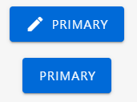|<ul><li>Icon與文字距離4px</li>|
default (depressed)|高|表單欄位內的關鍵動作選用|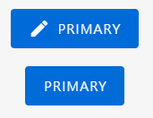|<ul><li>Icon與文字距離4px</li>|
otulined|中|次要動作選用||<ul><li>Icon與文字距離4px</li>|
text|低|最低優先層級選用|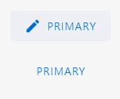|<ul><li>Icon與文字距離4px</li>|
icon|低|<ul><li>最低優先層級或小尺寸螢幕時選用</li><li>務必將動作名稱以tooltip呈現</li></ul>| 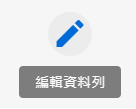||
icon(fab)|低|<ul><li>按鈕內容與區塊背景或資訊模糊時選用</li><li>務必將動作名稱以tooltip呈現</li></ul>| ||

#### (2)使用原則
- SyncoBox的所有按鈕，統一以Vuetify的「v-btn」為主，勿使用Kendo Button。
- 在版面充足的前提下，「最高優先等級按鈕」盡可能使用包含Icon的Contained Button，以利在小尺寸螢幕的RWD中，能夠轉換為Icon Button，而不至於導致使用者對個別按鈕功能的混淆。
- 若有相鄰的按鈕，請將「代表主要動作」的按鈕置於最右側(表格欄位內的按鈕不受此限)。
- 若有一個以上相同類型動作的按鈕相鄰，請將同類型動作的按鈕放入選單(menu)中，並依單一按鈕呼叫此選單，範例：

<span style="color:#4CAF50; font-weight:900; font-family: Roboto;">Do</span>|<span style="color:#FF5252; font-weight:900; font-family: Roboto;">Don't</span>
---|---|
|

#### (3)RWD設計

- 螢幕縮放的過程中，若按鈕從default button轉換為icon button，請確保Icon與按鈕邊界的左右間距相等。

縮小前|縮小後
---|---|
|<table>  <thead>  <tr>  <th></th>  <th><span style="color:#4CAF50; font-weight:900; font-family: Roboto;">Do</span></th>  <th><span style="color:#FF5252; font-weight:900; font-family: Roboto;">Don't</span></th>  </tr>  </thead>  <tbody>  <tr>  <td></td>  <td><code></code></td>  <td></td> </tbody>  </table> |


#### (4)各類型功能按鈕設計建議
Type|Color|Icon|Icon Description
---|---|---|---|---|---|
確定|primary|-||
取消||-||
新增/加入|primary or grey darken-1|mdi-plus-circle or mdi-plus-circle-outline| 
儲存|primary or grey darken-1|mdi-content-save|
編輯/變更/更新/設計|primary or grey darken-1|mdi-pencil|
刪除/移除|error or grey darken-1|mdi-delete|
設定|grey darken-1|mdi-cog|
預覽|grey darken-1|mdi-eye|
發布|primary|mdi-publish|
替換/更換/取代|-|mdi-twitter-retweet|
開啟(視窗、Dialog)、瀏覽詳細資訊|-|mdi-open-in-new|
上傳|-|mdi-cloud-upload|

**[⬆ back to top](#syncobox網頁設計規範)**

---

### 2-2 資料表格 Data Tables

#### (1)Table Title

Item|Class|Props|Color|Description
---|---|---|---|---|
Title Icon|.pr-3 or .mr-3||default|與Title Text距離12px|
Title Text|.v-card__title, .pl-3 or .ml-3||default|與Title Icon距離12px|
Search Field|.table-search, .ma-0 or.pa-0||default|請將搜尋欄元件置此區域的右側、CTA按鈕的左側|
CTA Button|.px-3 or .mx-3|default|primary|<ul><li>請將最優先等級CTA按鈕置於最右側</li><li>與其他CTA Button距離12px</li></ul>|

#### (2)Table Head
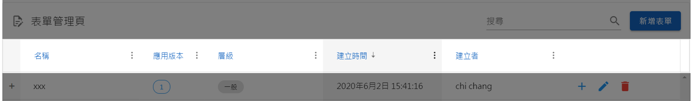
Item|Class|Props|Color|Description
---|---|---|---|---|
Cell|.py-3 .px-4|||<li>每一列皆為「單行」</li><li>長於欄寬的文本以省略號省略之</li><li>border-width: 0px 1px 1px 1px;</li>
Text|.subtitle-2||default||

#### (3)Table Body

Item|Class|Props|Color|Description
---|---|---|---|---|
Cell|.py-3 .px-4|||<li>每一列皆為「單行」</li><li>長於欄寬的文本以省略號省略之</li><li>(擬)以滑鼠點擊cell，展開全文</li><li>border-width: 0px 1px 1px 1px;</li>
Text|.body-2||default||
CTA Button|.mx-2|default, small|primary|每一列最多一個最高優先等級按鈕，並置於第一欄
Text Button|.mx-2|text, small|custom|<ul><li>每個button之間的margin間距為12px</li></ul>|
Icon Button|.mx-2|icon small|custom|<ul><li>每個button之間的margin間距為12px</li><li>hover: tooltip顯示動作名稱</li></ul>|
Chips|.mx-2|small|custom|<ul><li>請視資訊類型與優先程度，選擇是否使用outlined</li><li>勿使用label屬性，以免與Text Button混淆</li></ul>|

#### (4)Pagination 
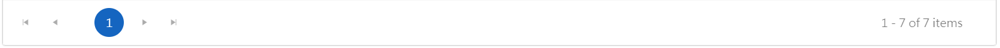
Item|Class|Props|Color|Description
---|---|---|---|---|
Pagination|||primary||

**[⬆ back to top](#syncobox網頁設計規範)**

---

### 2-3 Dialogs
#### (1)使用時機
- 發生阻止應用程式正常運行的錯誤時，給予使用者提醒。
- 為使用者進行任務、決策或無法回覆的動作時，給予關鍵訊息，加以確認、提醒或警告。

#### (2)類型

項次|種類|定義/使用|尺寸建議
---|---|---|---|---|
1|Alert Dialog|提供訊息供使用者確認時使用|<li>寬度：280px</li><li>高度：依內容而定</li>|
2|Confirmation Dialog|使用者須在Dialog中進行「除確認訊息外的」其他動作時使用|<li>寬度：依內容而定</li><li>高度：依內容而定</li>|

#### Alert Dialog
- 提供訊息供使用者確認時使用


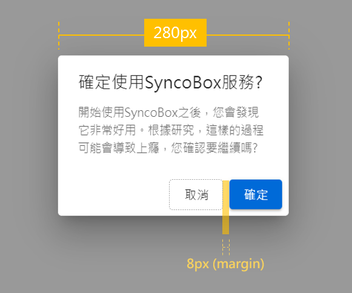 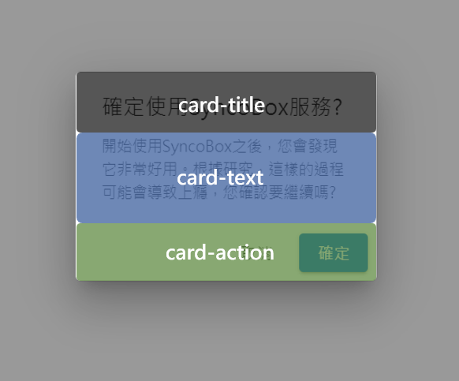

Item|Class|Props|Color|Description
---|---|---|---|---|---|
Card|default|max-width:280px|default||
Card Title|default|default|default||
Card Body|default|default|default||
Card Action|default|default|default|不應包含超過兩個以上的動作，若有必要的第三個動作，請以不同於「主要動作」的形式，置於其他適合的地方|
Cancel Button|text|default|default|<li>請將取消按鈕置於v-card-actions的右側</li><li>與相鄰的「確認」按鈕距離8px</li>|
Ok Button|default|default|primary|<li>請將確認按鈕置於v-card-actions的最右側</li><li>與相鄰的「取消」按鈕距離8px</li>|

#### Confirmation Dialog

- 使用者須在Dialog中進行「除確認訊息外的」其他動作時使用


 |

Part|Class|Props|Color|Description
---|---|---|---|---|---|
Card|default|default|default|寬度依內容而定|
Card Title|default|default|default||
v-divider|.ma-0|default|default|使用Confirmation Dialog，請在Card Title下方，Card Body上方之間加入 divider|
Card Body|default|default|default||
Card Action|default|default|default|不應包含超過兩個以上的動作，若有必要的第三個動作，請以不同於「主要動作」的形式，置於其他適合的地方|
Cancel Button|text|default|default|<li>請將取消按鈕置於v-card-actions的右側</li><li>與相鄰的「確認」按鈕距離8px</li>|
Ok Button|default|default|primary|<li>請將確認按鈕置於v-card-actions的最右側</li><li>與相鄰的「取消」按鈕距離8px</li>|

#### (3)Demo

[Dialogs Demo](https://codepen.io/WeBIM_RD/pen/abdmVEM)

**[⬆ back to top](#syncobox網頁設計規範)**

---

### 2-4 標籤 Chips

#### (1) 種類、定義與使用原則


項次|種類|定義/使用|範例|尺寸建議
---|---|---|---|---|
1|Information Chips|顯示資訊用|分類標籤(tags)、資料狀態(status)|small 以上
2|Action Chips|動態產生且具有操作或互動功能|帶有Avatar的Email收件人資訊|default 以上

<span style="color:#4CAF50; font-weight:900; font-family: Roboto;">Do</span>|<span style="color:#FF5252; font-weight:900; font-family: Roboto;">Don't</span>|
---|---|
||
<li>容易區分Chips與相鄰物件的不同</li>|<li>若相鄰或同一容器中有配置重要的按鈕元件，請勿使用Chips中的「label」屬性，<span style="color:#FF5252; font-weight:900;">避免Chips與按鈕呈現相似的外觀，造成使用者在操作上的混淆</span></li>|

#### (2) SPEC

- 規格表

Container(包裹Chips的父容器)|Type|Class|Props|Color|Description
---|---|---|---|---|---|
表格|Information Chips|.mr-2|<ul><li>small</li><li>outlined(optional)</li></ul>|視資訊優先(重要)層級決定顏色||
表格|Action Chips|.mr-2|<ul><li>small</li><li>加入icon</li></ul>|primary|Action Chips請加入icon於左側|
Card, Combobox或其他|Information Chips|.mr-2|-|視資訊優先(重要)層級決定顏色||
Card, Combobox或其他|Action Chips|.mr-2|<ul><li>加入icon</li></ul>|primary|Action Chips請加入icon於左側|

- 圖示

類型|圖例|說明|
---|---|---|
Information Chips||<li>Chips之間保留8px的margin</li>
Action Chips||<li>Chips之間保留8px的margin</li><li>Icon與Chips文字之間保留8px的margin</li><li><span style="color:#FF5252; font-weight:900;">具有small屬性的Action Chips，應避免選用 "-circle" 類型的icon (請參考此元件的 [Demo連結](https://codepen.io/WeBIM_RD/pen/xxZEKBa))</span></li>


#### (3) 色彩與樣式使用建議

- 建議表

色彩|樣式|優先等級|
---|---|---|
default|outlined|一般|
custom(自訂)|outlined|一般|
default|default|次高|
primary|default|最高|

- 圖示


#### (4)Demo

[Chips Demo](https://codepen.io/WeBIM_RD/pen/xxZEKBa)

**[⬆ back to top](#syncobox網頁設計規範)**

---

### 2-5 載入進度條 Loader

#### (1) 種類與使用原則

項次|種類|優先等級|使用時機|使用原則|圖示|
---|---|---|---|---|---|---|
1|Skeleton loaders|優先|<li>全頁載入</li><li>區塊內容載入</li>|若能符合載入前與載入後的頁面布局(layout)一致性，應優先使用Skeleton loaders|
2|Progress Circular|一般|<li>全頁載入</li><li>區塊內容載入</li>|若因layout考量而無法使用Skeleton，則使用Progress Circular|
3|Progress Linear|輔助|<li>表格資料載入</li>|搭配Progress Circular一起使用|

#### (2) 使用建議

 - 色彩建議

種類|色彩|
---|---|
Skeleton loaders|default
Progress Circular|primary
Progress Linear|primary

 - 表格loader使用
 
<span style="color:#4CAF50; font-weight:900; font-family: Roboto;">Do</span>|<span style="color:#FF5252; font-weight:900; font-family: Roboto;">Don't</span>
---|---|
|
<li>table body區塊加入Progress Circular，避免正在載入的區域的視覺空白</li>|<li>沒有加入loader動畫的地方，容易讓使用者誤以為「該區塊沒有需要載入的資訊」</li>|

#### (3) 目標

應使Progress loader符合以下目標：<br/>
 - 在載入進行時，讓使用者能夠預期即將載入的內容，而不造成太強烈的驚喜感<br/>
 - 應讓使用者掌握載入的狀態，包含「已載入」與「未載入」的進度百分比或時間顯示<br/>
 - 有趣而不無聊的loader動畫

#### (4)Demo

[Loaders Demo](https://codepen.io/WeBIM_RD/pen/yLeaKJP)

**[⬆ back to top](#syncobox網頁設計規範)**

---

### 2-6 菜單 Menus

#### (1) 使用時機

 - 菜單在使用者操作具有互動與控制性質的元件時，以非常駐的方式，顯示選單或其他操作控件。


#### (2) 使用原則

 - 以offset動態顯示菜單，避免菜單顯示後覆蓋呼叫菜單的元件資訊
 - 菜單的顯示範圍，盡可能避免覆蓋執行動作本身，以及其相關的重要資訊
 - 若菜單的內容包含操作功能，應為簡單且直覺的操作方式。若為複雜的操作(如：設定多種參數)，請改以其他容器包裹之。

#### (3) 使用建議

- Spec

Default <span style="color:#4caf50; font-weight:900;">(Vuetify Menus已繼承Material Design規範與格式)</span>

- 注意事項

(a) 自動判斷顯示位置 [Demo](https://codepen.io/WeBIM_RD/pen/RwrVKgB)

初始化顯示|<span style="color:#4CAF50; font-weight:900; font-family: Roboto;">Do</span>|<span style="color:#FF5252; font-weight:900; font-family: Roboto;">Don't</span>
---|---|---|
|||

(b) 適當的menu內容 [Demo](https://codepen.io/WeBIM_RD/pen/RwrVKgB)

<span style="color:#4CAF50; font-weight:900; font-family: Roboto;">Do</span>|<span style="color:#FF5252; font-weight:900; font-family: Roboto;">Don't</span>|
---|---|
||
<li>Menu之所以稱為Menu，就是因為他是讓使用者進行「選擇」</li><li>放入簡單、直覺且適當的操作內容</li>|<li>一個以上的操作項目，不適合放在Menu的內容中</li>

**[⬆ back to top](#syncobox網頁設計規範)**

---

## 3. 頁面設計
本章「頁面設計」主要針對特定頁面的layout與元件使用進行個別規範。

### 3-1 App頁面設定


#### (1) 概觀

預覽狀態|編輯狀態
---|---|
|

- Spec

Part|Class|Props|Color|Description
---|---|---|---|---|
Card|.pa-5|default|||
Card Title|.py-0|default|||
Card Text|default|default|||

- 圖示
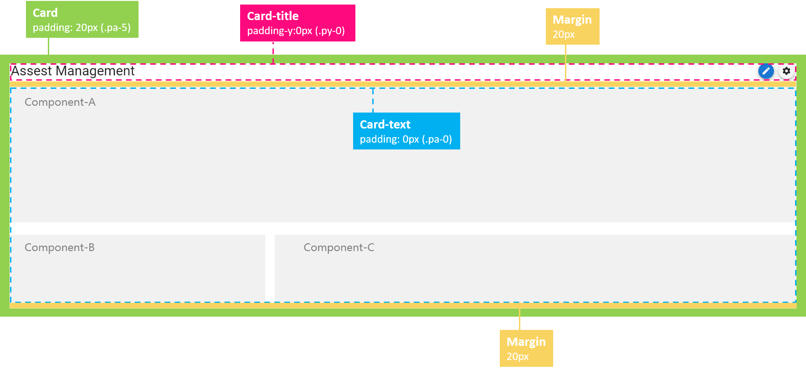

#### (2) 預覽狀態

- Spec

Item|Class|Props|Color|Description
---|---|---|---|---|
Title Text|.display-1|default|||
Icon Button(編輯)||<ul><li>fab</li><li>small</li>|primary|<ul><li>icon: mdi-pencil</li><li>須提供tooltip，顯示動作名稱</li></ul>|

- 圖示


#### (3) 編輯狀態

- Spec

Item|Class|Props|Color|Description
---|---|---|---|---|
Title textfield|.display-1|full-width|||
Title Text Button(取消)|.ma-2|<ul><li>text</li><li>outlined</li>|default||
Title Button(儲存)|.ma-2|default|primary|<ul><li>icon: mdi-content-save</li></ul>|
Components Icon Button(編輯)|<ul><li>.mt-3</li><li>.mr-3</li></ul>|<ul><li>fab</li><li>x-small</li></ul>|primary|<ul><li>icon: mdi-pencil</li><li>須提供tooltip，顯示動作名稱</li><li>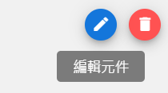</li>|
Components Icon Button(刪除)|<ul><li>.mt-3</li><li>.mr-3</li></ul>|<ul><li>fab</li><li>x-small</li></ul>|error|<ul><li>icon: mdi-delete</li><li>須提供tooltip，顯示動作名稱</li><li>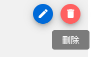</li>|

- 圖示


#### (4)Demo

[App頁面設定 Demo](https://codepen.io/WeBIM_RD/pen/eYJZjpQ)


**[⬆ back to top](#syncobox網頁設計規範)**

---

### 3-2 資產管理頁面

#### (1) Single Component App Page

- 概觀

資產管理頁面|資產管理頁面SPEC|
---|---|
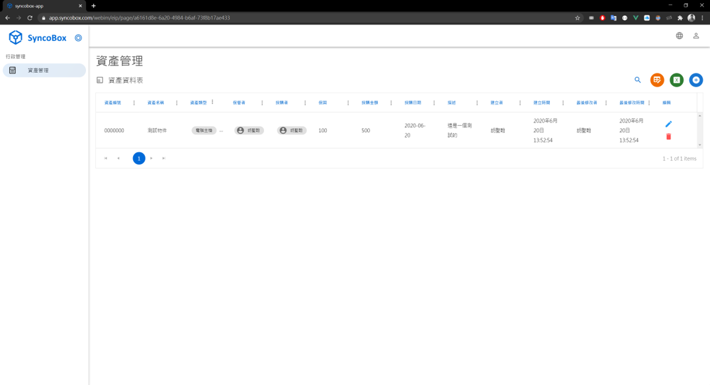||

- 詳細規格


**[⬆ back to top](#syncobox網頁設計規範)**

---

**其他資源:**

- 📖 [Google Material Design Components](https://material.io/components)
- 📖 [Google Material Design Typography](https://material.io/components)
- 📖 [Vuetify Typography](https://material.io/components)
- 📖 [Nielsen Norman Group-10 Usability Heuristics for User Interface Design](https://www.nngroup.com/articles/ten-usability-heuristics/)